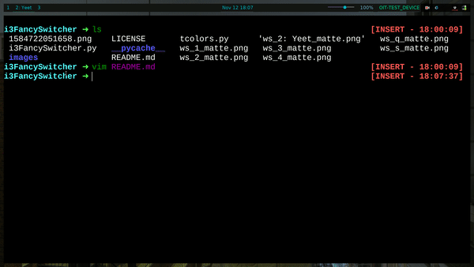
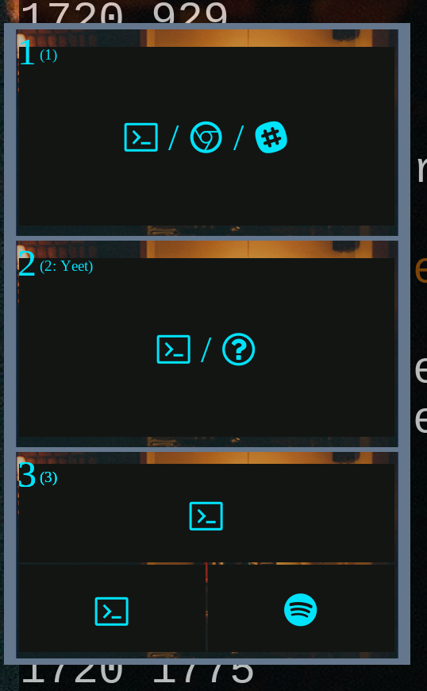

# i3FancySwitcher
When run displays an overview of open workspaces and applications in i3. You
can then select a workspace to switch to by clicking on it. Intended to be a
fancy drop in addition to i3.



To actually travel to the desired workspace the user can either click on the image
representation of said workspace, or press the numerical shortcut that has been 
associated with the workspace (the number in the top right corner). Should the user
press a key that's not been denoted as a shortcut, instead a workspace of that name
will be created. E.g. The user presses `w` -> User is then taken to a new workspace
`w`. In parentheses the name of the workspace is displayed.

Colors are read from .Xresources by [tcolors](https://github.com/mkoskar/tcolors)

### Pictures
Here's the bar running in the horizontal, bottom position. The `--glyphs` flag
wasn't specified on the command line, so we just use text to describe what's
open in the various workspaces. This is nice if you don't have some kind of [NerdFont](https://www.nerdfonts.com/)
installed.


Contrast the above image to this one. The program is now running with the location
set to vertical, left. Additionally `--glyphs` has been set so programs are now
described with the icon if it's available (the question mark appears for programs that
have no icon match). Furthermore you might notice a slight increase in size, that's
because `--scale` has been changed from 0.15 to 0.2 with respect to the image above.



### Usage
```
Usage: python3 i3FancySwitcher -b [BACKGROUND_IMAGE] -f [FONT.TTF] [OPTIONAL_ARGS]
	-b/--background: Path to the background image to use
	-f/--font: Path to the .ttf file to use for the text
	-l/--location: Location of the bar, options of 'vl', 'vr', 'ht', 'hb' (vertical left/right, horizontal top/bottom). If not given defaults to the center of the screen.
	-g/--glyphs: no argument, specifies whether to describe workspace windows using icons or just text. Defaults to text
	-s/--scale: Percentage of screen real estate to take up, defaults to 20%
	-h/--help: Prints the usage
```

### TODO
- [ ] Actually nice command line argument structure
- [ ] Fix scaling issues on buttons
- [ ] SPEEEEEEEEED
